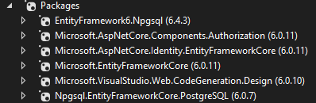
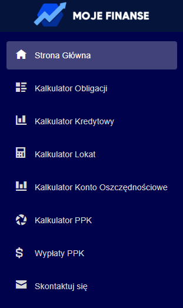
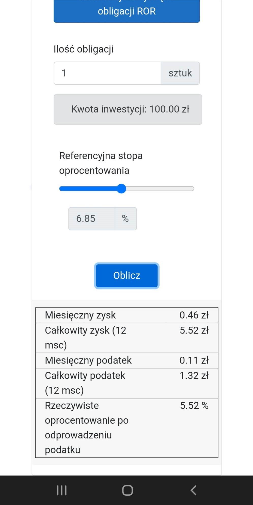
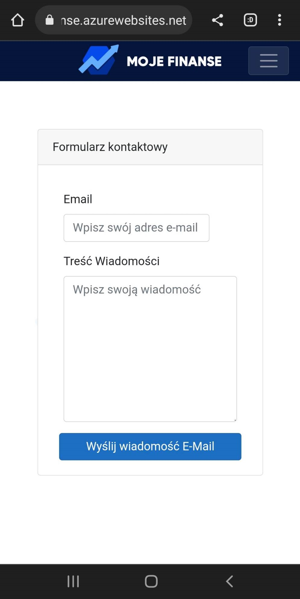
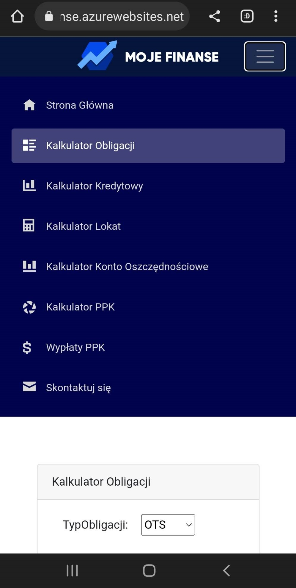
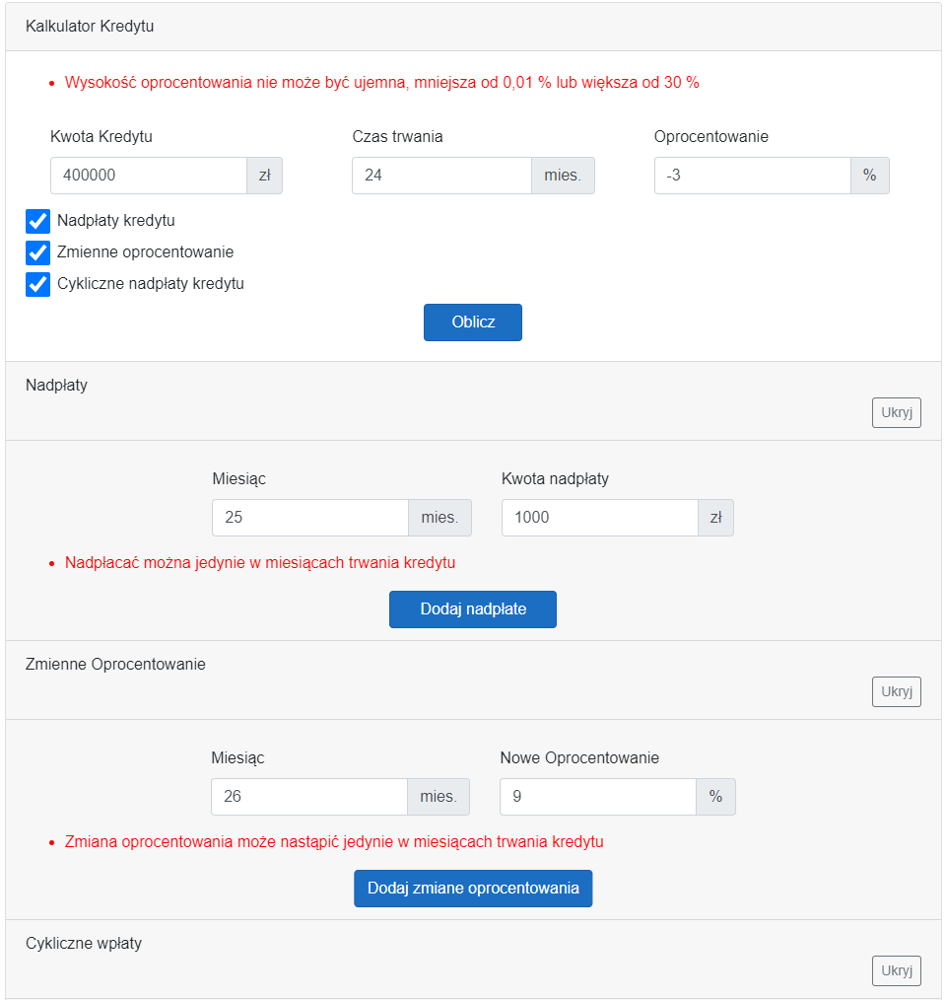
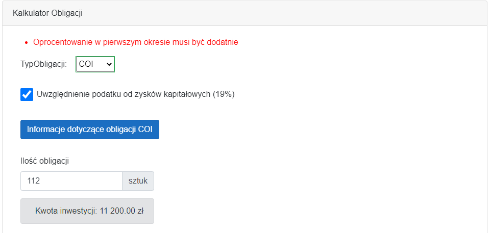

# Aplikacja Moje Finanse
> 
Aplikacja wspomaga wykonywanie wielu obliczeń związanych z finansami osobistymi. Moje Finanse to doskonałe narzędzie dla osób, które chcą mieć pełną kontrolę nad swoimi finansami i zarządzać nimi w sposób efektywny.

## Spis Treści
* [Ogólne Informacje](#general-info)
* [Technologie](#technologies)
* [NuGets](#nugets)
* [Funkcje](#features)
* [Status](#status)
* [Przewodnik](#guide)
* [Przykłady Kodu](#examples)
* [Inspiracja](#inspiration)
* [Kontakt](#contact)

## Ogólne Informacje

Aplikacja Moje Finanse udostępnia użytkownikowi zestaw narzędzi do zarządzania finansami osobistymi.
Umożliwia wyliczenie zysków z dostępnych w Polsce obligacji skarbowych.
W kalkulatorze kredytowym użytkownik ma możliwość zobaczyć i zrozumieć mechanizmy działające na kredyty a także sprawdzić wpływ nadpłat na harmonogram spłat.
Kalkulator lokat i kont oszczędnościowych pozwala wyliczać przewidywane zyski z inwestycji w tego typu instrumenty.
Każde z obliczeń można wykonać z uwzględnieniem podatku Belki lub bez niego (produkty jak IKE, IKZE, PPK).
Kalkulator PPK pozwala oszacować wysokość wypłaty z PPK w zależności od wpłaconych środków.

## Technologie
* .NET Core - version 6.0

## NuGets


## Funkcje
Lista dostępnych funkcji dla użytkownika, oraz przyszłe pomysły
* Kalkulator Obligacji
* Kalkulator Kredytowy
* Kalkulator Lokat
* Kalkulator Konto Oszczędnościowe
* Kalkulator Procentu Składanego
* Kalkulator PPK
* Kalkulator Wypłat PPK
* Formularz Kontaktowy
* Konta użytkowników
* Konfiguracja aplikacji

To-do lista:
* Automatyczna synchronizacja informacji dotyczących obligacji ze stron rządowych (web-scrapping)
* Kalkulator zmian giełdowych
* Export wyników do PDF

## Status

Projekt jest gotowy do użycia, istnieje możliwość wykorzystywania bazy danych.
Stale jest rozwijany.

## Przewodnik



### Logowanie
### Funkcje Administratorskie
#### Zarządznie kontami użytkowników
#### Konfigurowanie domyślnych wartości
### Kalkulator Obligacji
### Kalkulator Kredytowy
### Kalkulator Lokat
### Kalkulator Konta Oszczędnościowego
### Kalkulator PPK
### Kalkulator wypłat PPK
### Kontakt

### Wersja mobilna
Aplikacja prawidłowo działa również na urządzeniach mobilnych.




### Walidatory
Większość pól w aplikacji jest zabezpieczona przed wprowadzaniem złych wartości.
Jeśli jednak użytkownikowi uda się wprowadzić coś błędnie, dostanie o tym informacje.
##### Błędy w kalkulatorze kredytów

##### Błędy w kalkulatorze obligacji



## Przykłady Kodu
Tabele podsumowywujące SummaryTable.razor
```
   <p>
    <div class="card-footer">
        @foreach (var item in Content)
        {
            <div class="row" id="rowinfoot">
                <div class="col-7">@item.Item1</div>
                <div class="col-5 text-right" style="white-space:nowrap">@item.Item2</div>
            </div>
        }
    </div>
</p>

@code {
    [Parameter]
    public List<Tuple<string, string>> Content { get; set; }
}
```

Inicjalizacja serwisów odpowiedzialnych za poszczególne zakładki
```
services.AddSingleton<DebentureService>();
services.AddSingleton<LoanService>();
services.AddSingleton<DepositService>();
services.AddSingleton<PPKService>();
services.AddSingleton<MailService>();
services.AddSingleton<PPKPayoutService>();
services.AddSingleton<DepositAccountService>();
```

## Inspiracja

Moje Finanse została stworzona na potrzeby własnych prostych kalkulacji finansowych.
Aplikacja ta pozwoliła zastąpić excel i przyspieszyć wiele szacunków/obliczeń.
Rozpowszechniona została wśród moich znajomych, który bardzo pozytywnie ją odebrali.

## Kontakt
Stworzone przez Jarosław Czerniak [@jikoso2](https://github.com/jikoso2) - Odwiedź mój GitHub!